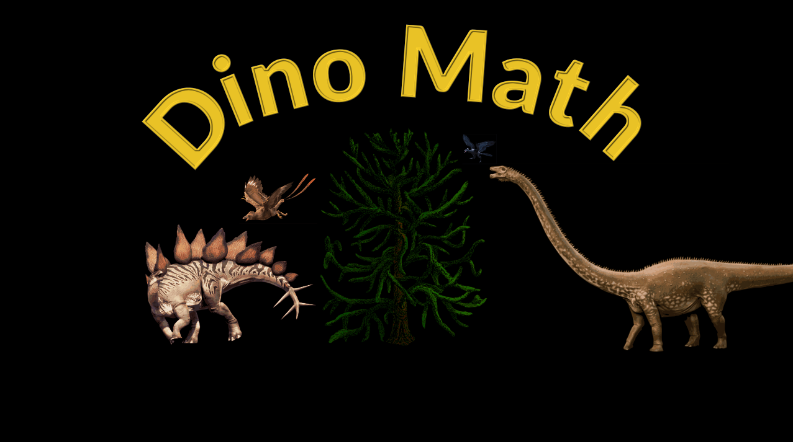
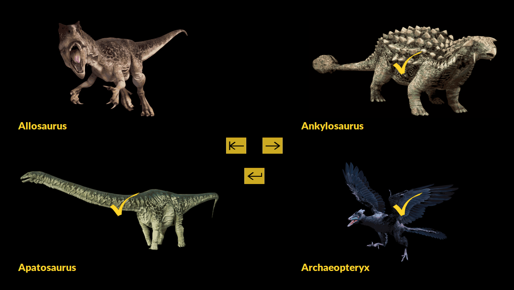
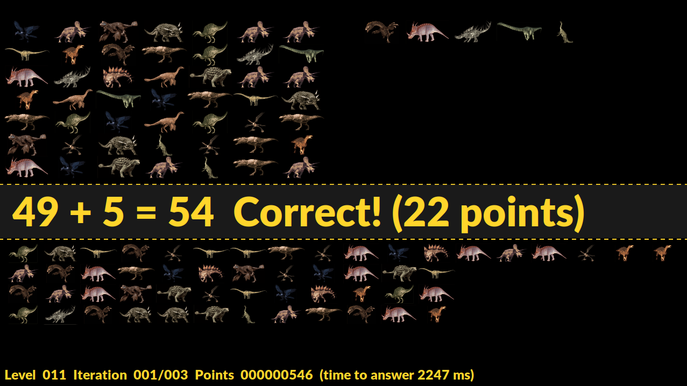
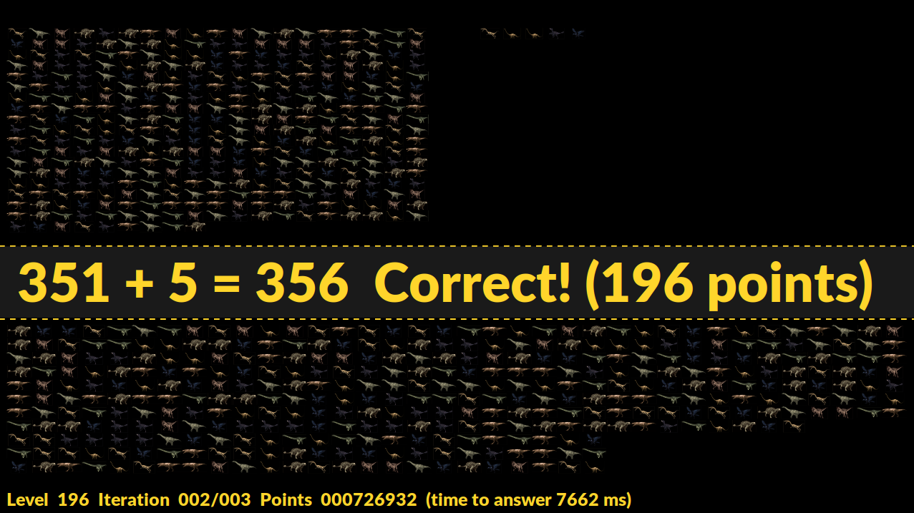

## 1 Introduction
Dino Math is a dinosaur math game made for primary school kids

## 2 Gameplay
Title screen:


Dino selection screen:


Beginning of gameplay:


After many levels of gameplay:


YouTube:
[](http://www.youtube.com/watch?v=WZyuaUp8wBc "Dino Math Gameplay")

## 3 Build Instructions (Ubuntu)
```
apt-get install libpng-dev
apt-get install librsvg2-dev
apt-get install libcairo2-dev
apt-get install fonts-lato
cmake .
make && make install
```

## 4 Command Line Options
```
usage: dino_math [OPTION]

Options:
 -f --fullscreen-games   Fullscreen mode
    --screen-width=INT   Screen width (default 1280)
    --screen-height=INT  Screen height (default 720)
 -h --help               Show this help screen
```

